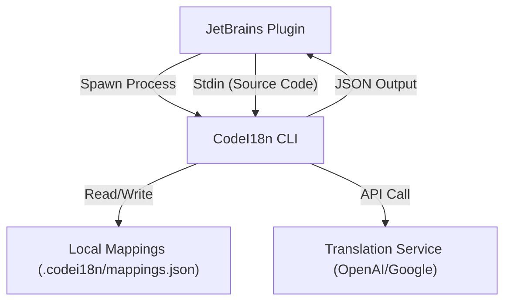

# CodeI18n JetBrains IDE 插件开发指南

本文档为 CodeI18n JetBrains IDE 插件（如 GoLand, IntelliJ IDEA）的开发提供技术指导。该插件的核心职责是作为 CodeI18n CLI 工具的 GUI 前端，负责渲染注释翻译、触发翻译任务以及管理配置。

## 1. 架构概览

插件采用 **CLI 驱动架构**。所有核心逻辑（AST 解析、ID 生成、翻译管理）均由 `codei18n` CLI 处理，插件专注于 UI 渲染和进程交互。



## 2. 核心功能实现指南

### 2.1 初始化与配置检测

插件加载时，应检查项目根目录下是否存在 `.codei18n/config.json`。

- **未初始化**: 提示用户运行初始化向导。
  - **Action**: 调用 `codei18n init --source-lang <src> --target-lang <target>`
- **已初始化**: 读取配置，准备运行环境。

### 2.2 Inlay Hints (内嵌提示)

这是插件最核心的功能，用于在代码编辑器中直接显示中文注释。

#### 实现机制
使用 IntelliJ Platform 的 `InlayHintsProvider` (或 `InlayModel`)。

#### 数据获取流程
1.  **监听文件变更**: 当用户停止输入（Debounce 300ms-500ms）或保存文件时触发。
2.  **调用 CLI**:
    ```bash
    # 关键参数:
    # --file: 必须提供，用于生成稳定的语义 ID
    # --stdin: 必须使用，传入编辑器当前的"脏"缓冲区内容
    # --format json: 获取结构化数据
    # --with-translations: 一次性获取 ID 和对应的翻译
    
    cat <current_buffer_content> | codei18n scan --file <relative_path> --stdin --format json --with-translations
    ```
3.  **解析输出**:
    读取 CLI 的 `stdout`（忽略 `stderr` 中的日志）。输出格式如下：
    ```json
    {
      "file": "main.go",
      "comments": [
        {
          "id": "a1b2c3d4...",
          "range": { "startLine": 10, "startCol": 1, "endLine": 10, "endCol": 20 },
          "sourceText": "Calculate sum",
          "translation": "计算总和"  // 若为空，说明尚未翻译
        }
      ]
    }
    ```
4.  **渲染 Hints**:
    - 遍历 `comments` 列表。
    - 如果 `translation` 字段不为空，在 `range.endCol` 之后（或下一行）渲染 Inlay Hint。
    - **样式建议**: 使用灰色斜体，前缀 `// ↓` 或 `// ` 区分。

### 2.3 悬停提示 (Hover Documentation)

除了 Inlay Hints，还可以提供鼠标悬停显示的完整翻译。

- **触发**: `DocumentationProvider`
- **逻辑**:
    - 获取鼠标位置的 AST 节点。
    - 计算或查找对应的 Comment ID (由于 ID 生成逻辑在 CLI，建议复用 Scan 结果的缓存)。
    - 显示 `translation` 内容。

### 2.4 触发翻译任务

当代码中出现新注释时，用户需要触发翻译。

- **Action**: "Translate Missing Comments"
- **CLI 调用**:
    ```bash
    codei18n translate --provider <config_provider>
    ```
- **UI 反馈**:
    - 显示后台任务进度条。
    - 监听 CLI 的 stdout/stderr 获取进度。
    - 完成后刷新 Inlay Hints。

### 2.5 映射更新

当用户修改了源码注释后，需要更新映射文件。

- **Action**: "Update Mappings" (或在保存文件时自动触发)
- **CLI 调用**:
    ```bash
    codei18n map update
    ```

## 3. 关键技术点

### 3.1 进程交互 (Process Handling)
- 使用 `com.intellij.execution.configurations.GeneralCommandLine`。
- **重要**: 必须正确设置 `WorkDirectory` 为项目根目录，否则 CLI 无法找到 `.codei18n` 配置。
- **环境变量**: 确保 `PATH` 中包含 `codei18n`，或允许用户配置 CLI 的绝对路径。

### 3.2 性能优化
- **Debounce**: 不要每次按键都调用 CLI。
- **缓存**: 在 IDE 内存中缓存 Scan 结果，仅在 CLI 返回新数据时更新 UI。
- **并发**: `scan` 操作通常很快 (<100ms)，但在大项目中仍应在后台线程执行 (ReadAction / BackgroundTask)。

### 3.3 错误处理
- 监控 CLI 的 Exit Code。
- 如果 Exit Code != 0，读取 `stderr` 并通过 Notification 提示用户错误信息（如 "OpenAI API Key invalid"）。

## 4. 开发排期建议

1.  **P0**: 实现 `GeneralCommandLine` 封装，能够成功调用 `codei18n --version`。
2.  **P0**: 实现 `InlayHintsProvider`，调用 `scan` 并解析 JSON 渲染简单的文本。
3.  **P1**: 支持 Stdin 输入，实现实时预览。
4.  **P1**: 集成 `translate` 命令动作。
5.  **P2**: 配置页面（设置 CLI 路径、翻译语言等）。

## 5. 参考资源

- [IntelliJ Platform SDK - Inlay Hints](https://plugins.jetbrains.com/docs/intellij/inlay-hints.html)
- [IntelliJ Platform SDK - Running Processes](https://plugins.jetbrains.com/docs/intellij/process-execution.html)
- [CodeI18n CLI Commands](contracts/cli_commands.md)
