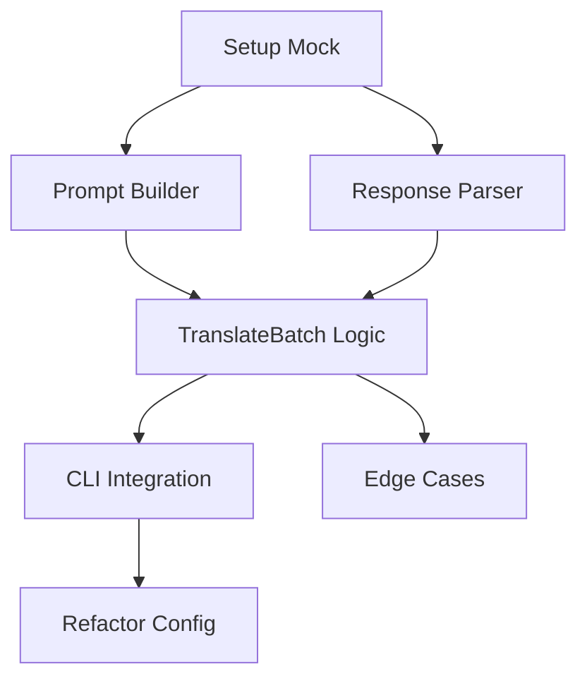

# 可执行任务列表: 批量翻译优化

**功能**: 批量翻译优化 (`batch-translation`)
**创建时间**: 2025-12-17
**状态**: 已完成

## 阶段 1: 基础设施搭建 (Setup)

本阶段主要准备测试环境，因为批量翻译依赖于 LLM 行为，需要 Mock 机制。

- [x] **T001**: 准备 LLM Mock 环境 [Setup]
    - **文件**: `adapters/translator/mock_llm_test.go`
    - **描述**: 创建一个 Mock OpenAI Client 或封装层，用于模拟返回 JSON 格式的 Batch 响应，以及错误的响应（格式错误、长度不匹配）。
    - **验证**: 能够拦截 `CreateChatCompletion` 并返回预定义的 JSON 字符串。

## 阶段 2: 核心任务 (Core Implementation)

本阶段实现 `TranslateBatch` 的核心逻辑，包括 Prompt 构建、JSON 解析和错误回退。

- [x] **T002**: 实现 Batch Prompt 构建器 [US1] [P]
    - **文件**: `adapters/translator/llm.go`, `adapters/translator/llm_test.go`
    - **描述**: 在 `LLMTranslator` 中添加辅助方法 `buildBatchPrompt(texts []string, from, to string) string`。构建符合 JSON Array 格式的 Prompt。
    - **验证**: 单元测试验证生成的 Prompt 包含 JSON 格式的输入数组和正确的指令。

- [x] **T003**: 实现 JSON 响应解析与验证 [US1] [P]
    - **文件**: `adapters/translator/parser.go`, `adapters/translator/parser_test.go`
    - **描述**: 实现 `parseBatchResponse(resp string) ([]string, error)`。处理 Markdown 代码块（```json ... ```），解析 JSON，并验证返回数组的长度。
    - **验证**: 单元测试覆盖：标准 JSON、带 Markdown 的 JSON、无效 JSON、长度不匹配的情况。

- [x] **T004**: 实现 TranslateBatch 逻辑与回退机制 [US1]
    - **文件**: `adapters/translator/llm.go`
    - **描述**: 重写 `TranslateBatch`。
        1. 检查输入长度，若 <= 1 调用 `Translate`。
        2. 构建 Prompt 调用 API。
        3. 解析结果。
        4. 如果成功且长度匹配，返回结果。
        5. 如果失败（解析错或长度错），记录日志并调用 `TranslateBatchSequential`（原循环逻辑）。
    - **验证**: 集成测试：Mock 成功响应 -> 验证返回；Mock 失败响应 -> 验证是否回退到逐条调用（Mock 逐条调用的接口）。

## 阶段 3: 集成与测试 (Integration)

- [x] **T005**: 批处理大小配置与 CLI 集成 [Refinement]
    - **文件**: `cmd/codei18n/translate.go`, `core/config/config.go`
    - **描述**: 在 `config` 中添加 `BatchSize` (默认 10)。在 `translate` 命令中读取此配置，并将任务分块调用 `TranslateBatch`。
    - **验证**: 运行 `codei18n translate --batch-size 5`，验证是否按每组 5 个进行 API 调用（通过日志观察）。

- [x] **T006**: 边界情况测试 [US1]
    - **文件**: `adapters/translator/llm_test.go`
    - **描述**: 测试特殊字符（换行符、引号）在 JSON 中的转义处理。测试空数组输入。
    - **验证**: 确保 JSON Marshal/Unmarshal 正确处理特殊字符。

- [x] **T007**: 重构配置项 translationProvider [Refactor]
    - **文件**: `core/config/config.go`, `cmd/codei18n/translate.go`
    - **描述**: 将配置项 `translationProvider` 的值从 `openai` 改为 `llm`，以支持更通用的 LLM API（如 DeepSeek）。保持对 `openai` 的兼容性（视为 `llm` 的别名）。
    - **验证**: 在配置文件中使用 `provider: llm` 和 `provider: openai` 都能正常工作。

## 依赖关系图



## 实现策略

1.  **安全第一**: 任何 Batch 失败都必须无缝降级为逐条翻译，确保用户任务完成（即使慢一点）。
2.  **JSON 健壮性**: LLM 经常输出不规范的 JSON（如末尾逗号、Markdown 包裹），解析器必须足够宽容。
