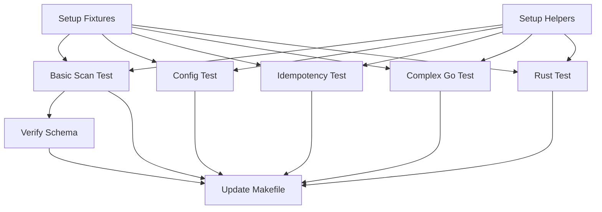

# 任务: Integration Test Coverage

**功能**: Integration Test Coverage
**状态**: 草稿
**分支**: `004-integration-test-coverage`
**日期**: 2025-12-17

## 实施策略

- **增量实现**: 按用户故事顺序，一次实现一个测试文件/场景。
- **并行执行**: 不同的测试文件可以并行创建和运行。
- **复用性**: 先建立公共测试辅助函数，再编写具体测试。
- **验证优先**: 每个任务完成后，确保能通过 `go test` 运行。

## 阶段 1: 设置任务 (P0 - 基础设施)

**目标**: 建立测试所需的基础设施和公共辅助函数，确保后续测试任务可以高效进行。

- [x] **T001**: 创建测试目录结构和辅助函数文件 [US1]
  - 路径: `tests/test_helpers.go`
  - 描述: 创建 `tests/test_helpers.go` 文件，包含以下公共函数：
    - `buildBinary(t *testing.T) string`: 编译 CLI 二进制文件（使用 TestMain 优化，仅编译一次）
    - `createFile(t *testing.T, dir string, name string, content string)`: 在临时目录创建文件
    - `assertJSONSchema(t *testing.T, jsonBytes []byte)`: 验证 JSON 是否符合 schema 结构
  - 依赖: 无

- [x] **T002**: 创建测试夹具文件 [US1, US4, US5]
  - 路径: `tests/fixtures/fixtures.go`
  - 描述: 创建 `tests/fixtures/fixtures.go` 文件，使用 `embed` 或常量字符串定义所有测试用例数据：
    - `SimpleGoContent`: 简单的 Go 代码 (对应 spec 2.1)
    - `ComplexGoContent`: 复杂 Go 代码 (对应 spec 2.2)
    - `RustContent`: Rust 代码 (对应 spec 2.3)
    - `ConfigContent`: JSON 配置文件 (对应 spec 2.4)
  - 依赖: 无

## 阶段 2: 基础任务 - 核心工作流验证 (US1 - P1)

**目标**: 验证 CLI 的基本扫描和翻译功能，确保核心路径畅通。

- [x] **T003**: [P] 实现基础扫描集成测试 [US1]
  - 路径: `tests/ide_protocol_test.go`
  - 描述: 创建 `TestBasicScan` 函数：
    - 使用 `SimpleGoContent`
    - 执行 `codei18n scan --file simple.go --format json --provider mock`
    - 验证退出代码为 0
    - 反序列化 JSON 输出，验证包含预期的注释
    - 验证 `comments` 数组非空
  - 依赖: T001, T002

- [x] **T004**: [P] 验证 JSON 输出协议一致性 [US1]
  - 路径: `tests/ide_protocol_test.go`
  - 描述: 增强 `TestBasicScan` 或新建 `TestJSONSchema`：
    - 确保输出的 JSON 字段严格符合 `data-model.md` 和 `contracts/cli-output.schema.json`
    - 验证所有必需字段 (`id`, `range`, `type`) 均存在且格式正确
  - 依赖: T001, T002

## 阶段 3: 配置与参数优先级 (US2 - P2)

**目标**: 确保用户配置正确加载，且 CLI 参数具有更高优先级。

- [x] **T005**: [P] 实现配置加载优先级测试 [US2]
  - 路径: `tests/cli_flags_test.go`
  - 描述: 创建 `TestConfigPrecedence` 函数：
    - 场景 1: 仅有配置文件 (检查是否使用配置文件中的 targetLanguage)
    - 场景 2: 配置文件 + CLI 参数 (检查 CLI 参数是否覆盖配置)
    - 验证 `codei18n scan` 输出中的语言或行为变化
  - 依赖: T001, T002

## 阶段 4: 幂等性与增量更新 (US3 - P2)

**目标**: 验证多次运行不会破坏数据，且能正确处理增量变更。

- [x] **T006**: [P] 实现幂等性与增量更新测试 [US3]
  - 路径: `tests/integration_test.go` (增强现有文件)
  - 描述: 创建 `TestIncrementalScan` 函数：
    - 步骤 1: 初次扫描，检查映射文件生成
    - 步骤 2: 无修改再次扫描，检查映射文件哈希/内容未变
    - 步骤 3: 修改源文件（增加注释），再次扫描，检查映射文件仅增加新条目
  - 依赖: T001, T002

## 阶段 5: 复杂 Go 注释解析 (US4 - P2)

**目标**: 验证解析器对 Go 语言各种复杂注释的处理能力。

- [x] **T007**: [P] 实现复杂 Go 注释解析测试 [US4]
  - 路径: `tests/complex_parsing_test.go`
  - 描述: 创建 `TestComplexGoParsing` 函数：
    - 使用 `ComplexGoContent` (包含多行、块、行内、代码注释)
    - 执行扫描
    - 验证每种类型的注释都被正确提取
    - 验证位置信息 (`Range`) 准确
    - 验证被注释掉的代码是否被处理（根据预期行为）
  - 依赖: T001, T002

## 阶段 6: Rust 语言支持 (US5 - P2)

**目标**: 验证多语言扩展性，特别是 Rust 的特殊文档注释。

- [x] **T008**: [P] 实现 Rust 语言支持测试 [US5]
  - 路径: `tests/rust_integration_test.go`
  - 描述: 创建 `TestRustSupport` 函数：
    - 使用 `RustContent` (包含 `///`, `//!`)
    - 执行 `codei18n scan --file lib.rs`
    - 验证语言识别为 `rust`
    - 验证文档注释类型被正确标记 (`doc` vs `line`)
  - 依赖: T001, T002

## 阶段 7: 完善与 CI 集成

**目标**: 确保测试集成到构建流程中，并更新文档。

- [x] **T009**: 更新 Makefile [US1-US5]
  - 路径: `Makefile`
  - 描述: 确保 `make test-integration` 目标包含新添加的测试文件。如果使用的是 `./...`，则通常不需要更改，但需验证。
  - 依赖: 所有测试任务

- [x] **T010**: 更新 CI 配置 (可选)
  - 路径: `.github/workflows/ci.yml` (如果存在)
  - 描述: 确保 CI 环境具备运行这些集成测试的条件 (Go 环境等)。
  - 依赖: 无

## 依赖关系图

## 并行执行示例

- **开发者 A** 负责 **T005 (Config)** 和 **T006 (Idempotency)**
- **开发者 B** 负责 **T007 (Complex Go)** 和 **T008 (Rust)**
- **T003 (Basic Scan)** 是核心，建议优先完成或由 **开发者 A** 顺手完成。

## 报告摘要

- **总任务数**: 10
- **涵盖用户故事**: 5 (US1 - US5)
- **并行机会**: 高 (阶段 3, 4, 5, 6 可并行进行)
- **核心 MVP**: 完成阶段 1 和 2 (T001-T004) 即可验证核心价值。
